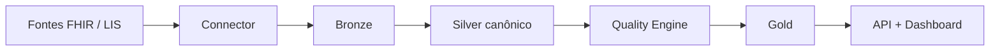

<p align="left">
  
  
  
  
  
  
  
  <!-- troque por um badge de CI real (ex.: GitHub Actions) assim que o pipeline existir -->
</p>

# 🧬 Veyra

**De FHIR bruto a dados clínicos utilizáveis.**

Veyra é a camada de dados entre o prontuário e o analytics. Recebe FHIR (e, depois, sistemas laboratoriais), normaliza para um modelo clínico canônico, mede qualidade e entrega Patient 360, indicadores de laboratório e a jornada do paciente — via warehouse, API e dashboard.

Clínicas, laboratórios e healthtechs já têm o dado. O que falta é transformá-lo, com governança, em BI, analytics e IA.

---

## 📚 Central de Documentação

| Módulo | Link de Acesso | Conteúdo |
|--------|-----------------|----------|
| 🏛️ **Arquitetura & Dados** | [`schema.md`](schema.md) | Camadas, grains, stack completa e fases do projeto |
| 🧩 **Modelo Canônico** | [`#o-que-o-veyra-faz`](#-o-que-o-veyra-faz) | FHIR aninhado → tabelas clínicas com chaves estáveis |
| ✅ **Qualidade de Dados** | [`#qualidade-como-produto`](#-qualidade-como-produto) | Regras, score e gate entre Silver e Gold |
| 🗺️ **Roadmap & Status** | [`#status`](#-status) | Onde o projeto está agora, MVP e próximos passos |
| 🚫 **Escopo** | [`#fora-de-escopo`](#-fora-de-escopo) | O que o Veyra não faz |

---

## ⚠️ O problema

Interoperabilidade não termina no transporte. Um bundle FHIR ou um export de LIS chega aninhado, com códigos heterogêneos, unidades inconsistentes e buracos silenciosos. Daí não sai um hemograma longitudinal, um TAT confiável nem um score de qualidade que o time de dados consiga defender.

O resultado típico: o EHR existe, o laboratório produz volume — e o analytics continua em planilha.

## 🔧 O que o Veyra faz

```
EHR / Synthea / LIS
        │  FHIR · NDJSON · CSV
        ▼
   Health Data Connector
        │
        ▼
   Lakehouse clínico          Bronze → Silver → Gold
        │
        ├── Quality Engine    score + catálogo de issues
        ├── Lab Warehouse     LOINC · UCUM · faixas · críticos
        └── Patient Journey   timeline · episódios · care gaps
        │
        ▼
   PostgreSQL  →  Dashboard  ·  REST API
        │
   Observability em cada hop
```

| Capacidade | Entrega |
|------------|---------|
| **Connector** | Ingestão batch (NDJSON) e, em seguida, API FHIR ao vivo |
| **Modelo canônico** | FHIR aninhado → tabelas clínicas com chaves estáveis |
| **Qualidade** | Completeness, validity, consistency, uniqueness, timeliness |
| **Labs** | Resultados interpretados, TAT, recoleta, valores críticos |
| **Jornada** | Linha temporal do paciente a partir de recursos isolados |
| **Serving** | O mesmo modelo no warehouse, na API e no dashboard |
| **Observability** | Volume, schema drift, freshness, códigos inválidos, pipelines |

> Não substitui o EHR. Não prescreve. Não decide clinicamente. Padroniza, valida e serve o dado para quem analisa.

## 🎯 Para quem

- Laboratórios que precisam de infraestrutura analítica, não só de laudo
- Clínicas e hospitais com API FHIR e pouca ponte para BI
- Healthtechs e pesquisa clínica que consomem dados heterogêneos
- Times de IA médica que não podem treinar em cima de Observation crua

O primeiro domínio de profundidade é **laboratório** (LOINC, UCUM, faixas de referência). O restante do modelo clínico (encontros, medicamentos, diagnósticos) entra no mesmo lakehouse.

## ✅ Qualidade como produto

A qualidade não é um relatório no fim. É um **gate** entre Silver e Gold: o score viaja com o dataset; issues graves podem ir para quarentena.

```
Dataset
 ├── 1.240.331 records
 ├── 3.2% missing values
 ├── 0.8% duplicates
 ├── 1.4% invalid codes
 └── 0.3% temporal inconsistencies

Completeness 91%   Validity 97%   Consistency 88%
Uniqueness   94%   Timeliness 82%   Overall 90%
```

Interoperabilidade, neste produto, inclui harmonização, sincronização, qualidade e governança — não só o POST na API FHIR.

## 🏗️ Arquitetura

Lakehouse medallion, vocabulários clínicos e serving desacoplado da ingestão.



O desenho completo — camadas, grains, stack e fases — está em [`schema.md`](schema.md).

| Camada | Papel |
|--------|--------|
| Bronze | Raw imutável no MinIO (S3) |
| Silver | dbt: FHIR → modelo canônico + LOINC/UCUM |
| Quality | Regras clínicas e Data Quality Score |
| Gold | Patient 360 · Lab Warehouse · Journey |
| Serving | PostgreSQL, FastAPI, dashboard |
| Observability | Drift, volume, freshness, falhas |

**Stack:** Python · FastAPI · Docker · MinIO · dbt · DuckDB / PostgreSQL · Prefect · Synthea no desenvolvimento.

Spark só entra se o volume passar do que DuckDB/Postgres resolvem. Desenvolvimento usa dados sintéticos — sem PHI real.

## 🗺️ Status

Arquitetura definida. Implementação a partir da fundação local (Compose + lake + loader Synthea).

| Agora | MVP | Depois |
|-------|-----|--------|
| Spec E2E em `schema.md` | Ingestão → Silver → qualidade → Gold lab + API mínima | Jornada, observability, FHIR ao vivo, LIS |

## 🚫 Fora de escopo

- Prontuário eletrônico ou prescrição
- Decisão clínica automatizada sem profissional
- Multi-tenant SaaS e Spark no MVP
- Conector LIS completo na primeira entrega