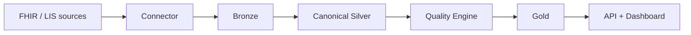

<p align="left">
  
  
  
  
  
  
  
  <!-- replace with a real CI badge (e.g. GitHub Actions) once the pipeline exists -->
</p>

# 🧬 Veyra

**From raw FHIR to usable clinical data.**

Veyra is the data layer between the EHR and analytics. It ingests FHIR (and, later, laboratory systems), normalizes it into a canonical clinical model, measures quality, and delivers Patient 360, lab indicators, and the patient journey — through a warehouse, an API, and a dashboard.

Clinics, labs, and healthtechs already have the data. What they lack is turning it, with governance, into BI, analytics, and AI.

---

## 📚 Documentation hub

| Module | Link | Contents |
|--------|------|----------|
| 🏛️ **Architecture & data** | [`schema.md`](schema.md) | Layers, grains, full stack, and project phases |
| 🧩 **Canonical model** | [`#what-veyra-does`](#-what-veyra-does) | Nested FHIR → clinical tables with stable keys |
| ✅ **Data quality** | [`#quality-as-a-product`](#-quality-as-a-product) | Rules, score, and the gate between Silver and Gold |
| 🗺️ **Roadmap & status** | [`#status`](#-status) | Where the project is now, MVP, and next steps |
| 🚫 **Scope** | [`#out-of-scope`](#-out-of-scope) | What Veyra does not do |

---

## ⚠️ The problem

Interoperability does not end at transport. A FHIR bundle or a LIS export arrives nested, with heterogeneous codes, inconsistent units, and silent gaps. That does not yield a longitudinal CBC, a trustworthy TAT, or a quality score a data team can stand behind.

The typical outcome: the EHR exists, the lab produces volume — and analytics still lives in a spreadsheet.

## 🔧 What Veyra does

```
EHR / Synthea / LIS
        │  FHIR · NDJSON · CSV
        ▼
   Health Data Connector
        │
        ▼
   Clinical lakehouse         Bronze → Silver → Gold
        │
        ├── Quality Engine    score + issue catalog
        ├── Lab Warehouse     LOINC · UCUM · ranges · criticals
        └── Patient Journey   timeline · episodes · care gaps
        │
        ▼
   PostgreSQL  →  Dashboard  ·  REST API
        │
   Observability on every hop
```

| Capability | Delivers |
|------------|----------|
| **Connector** | Batch ingest (NDJSON), then a live FHIR API |
| **Canonical model** | Nested FHIR → clinical tables with stable keys |
| **Quality** | Completeness, validity, consistency, uniqueness, timeliness |
| **Labs** | Interpreted results, TAT, recollection, critical values |
| **Journey** | Patient timeline rebuilt from isolated resources |
| **Serving** | The same model in the warehouse, the API, and the dashboard |
| **Observability** | Volume, schema drift, freshness, invalid codes, pipelines |

> It does not replace the EHR. It does not prescribe. It does not make clinical decisions. It standardizes, validates, and serves data for people who analyze.

## 🎯 Who it is for

- Labs that need analytics infrastructure, not just a report
- Clinics and hospitals with a FHIR API and little bridge to BI
- Healthtechs and clinical research teams consuming heterogeneous data
- Medical AI teams that cannot train on raw Observation payloads

The first deep domain is **laboratory** (LOINC, UCUM, reference ranges). The rest of the clinical model (encounters, medications, diagnoses) lives in the same lakehouse.

## ✅ Quality as a product

Quality is not a report at the end. It is a **gate** between Silver and Gold: the score travels with the dataset; severe issues can go to quarantine.

```
Dataset
 ├── 1,240,331 records
 ├── 3.2% missing values
 ├── 0.8% duplicates
 ├── 1.4% invalid codes
 └── 0.3% temporal inconsistencies

Completeness 91%   Validity 97%   Consistency 88%
Uniqueness   94%   Timeliness 82%   Overall 90%
```

Interoperability, in this product, includes harmonization, synchronization, quality, and governance — not just a POST to the FHIR API.

## 🏗️ Architecture

Medallion lakehouse, clinical vocabularies, and serving decoupled from ingestion.



The full design — layers, grains, stack, and phases — lives in [`schema.md`](schema.md).

| Layer | Role |
|-------|------|
| Bronze | Immutable raw in MinIO (S3) |
| Silver | dbt: FHIR → canonical model + LOINC/UCUM |
| Quality | Clinical rules and Data Quality Score |
| Gold | Patient 360 · Lab Warehouse · Journey |
| Serving | PostgreSQL, FastAPI, dashboard |
| Observability | Drift, volume, freshness, failures |

**Stack:** Python · FastAPI · Docker · MinIO · dbt · DuckDB / PostgreSQL · Prefect · Synthea in development.

Spark only lands if volume outgrows DuckDB/Postgres. Development uses synthetic data — no real PHI.

## 🗺️ Status

Architecture is defined. Implementation starts from the local foundation (Compose + lake + Synthea loader).

| Now | MVP | Next |
|-----|-----|------|
| E2E spec in `schema.md` | Ingestion → Silver → quality → Gold lab + minimal API | Journey, observability, live FHIR, LIS |

## 🚫 Out of scope

- Electronic health record or prescribing
- Automated clinical decisions without a professional
- Multi-tenant SaaS and Spark in the MVP
- A full LIS connector in the first delivery
